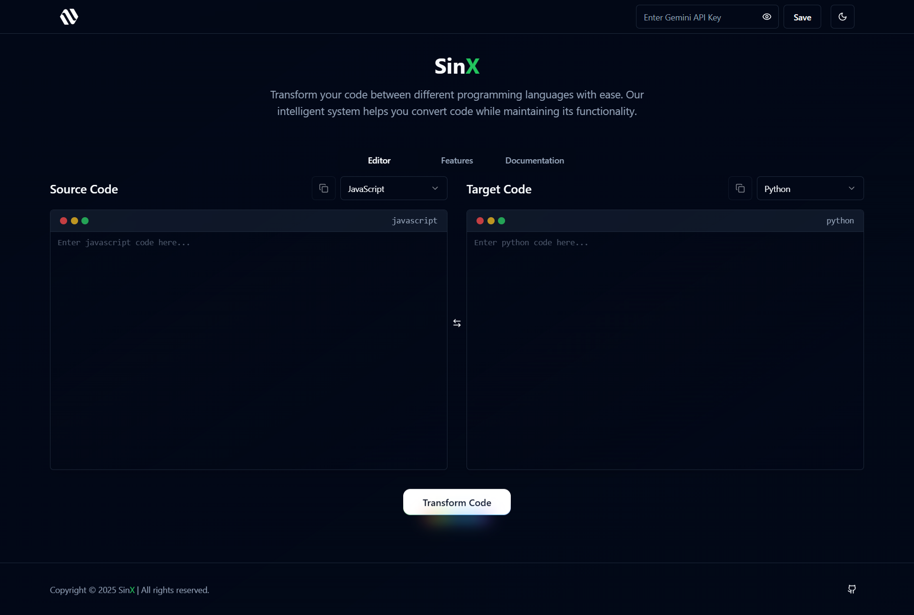

# SinX – Transform code between languages effortlessly.

## ⚙ Introduction

**SinX** is a **AI-Powered Code Transformation Platform** designed to empower developers to seamlessly convert code between different programming languages.  

---

<div align="center">

</div>

---

## 📋 Table of Contents

1. ⚙ [Introduction](#introduction)  
2. 🛠️ [Tech Stack](#tech-stack)  
3. 📊 [Features](#features)  
4. 🚀 [Quick Start](#quick-start)  
5. 💚 [Contributing](#contributing)   
6. 💬 [Support](#support)  

---

## 🛠️ Tech Stack

SinX is powered by the following technologies:  

<div>

  
  
  
  
</div>

---

## 📊 Features
  
- **Multiple Languages**: Support for various programming languages, including JavaScript, Python, Java, C++, and more.   
- **Intelligent Conversion**: Smart code transformation that maintains functionality and readability.  
- **Documentation**: Comprehensive documentation and examples for each language to ensure a smooth user experience.  
- **Quick Copy**: Easily copy source or converted code with a single click.  
- **Code Switching**: Instantly switch between source and target code while preserving formatting.   
- **Responsive User Interface**: Enjoy a modern, intuitive, and mobile-friendly design.  
- **Scalable Architecture**: Ensures high performance and adaptability for all user needs.  

---

## 🚀 Quick Start

Set up SinX locally by following these steps:

### **Prerequisites**  
Ensure the following are installed on your system:  
- [Git](https://git-scm.com/)  
- [Node.js](https://nodejs.org/)  

### **Clone the Repository**  
Navigate to your desired directory and run:  
```bash
git clone https://github.com/its-mkarmakar/SinX.git
```

---

### **Setup**  

1. Navigate to the server directory:  
   ```bash
   npm install
   ```

3. Start the server:  
   ```bash
   npm run dev
   ```

---

## 💚 Contributing

Contributions are welcome! To contribute:

1. Fork the repository.
2. Create a new branch:  
   ```bash
   git checkout -b feature/YourFeatureName
   ```
3. Make your changes and commit them:  
   ```bash
   git commit -m "Add YourFeatureName"
   ```
4. Push the branch:  
   ```bash
   git push origin feature/YourFeatureName
   ```
5. Open a pull request.

---

## 💬 Support

For support or inquiries, please contact:  
- **GitHub Issues**: [Report an Issue](https://github.com/i-mkarmakar/SinX/issues)  
- **LinkedIn**: [Manish Karmakar](https://www.linkedin.com/in/imkarmakar)


Thank you for using **SinX**! Transform code between languages effortlessly.

